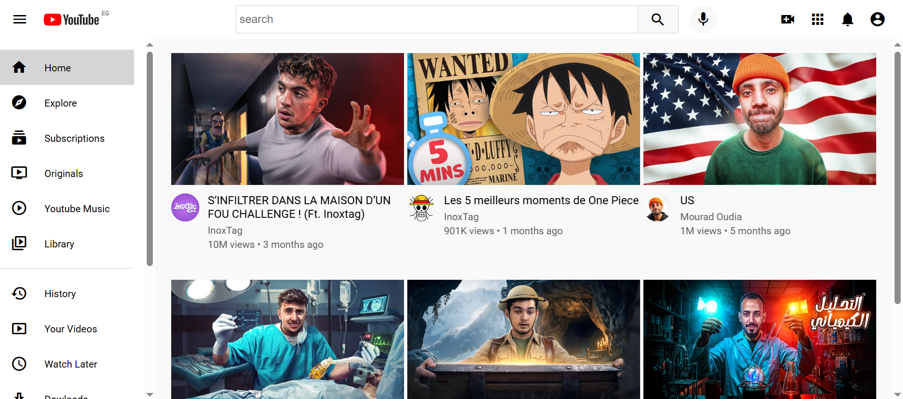

# a simple and Cool youtube Interface using only html and css 

This project helped me dive deeper into:
-  Structuring a web page using semantic and well-organized **divs**
-  Mastering **Flexbox** to create flexible responsive layouts
-  Styling multiple elements with precision and creativity
-  Writing clean organized code with good practices

---

## take a look at it 

##  Run It Yourself
Wanna try it out?

1. Clone this repo or download the files
2. Open the `index.html` in your browser

---
© 2025 Delhoum Lina 

